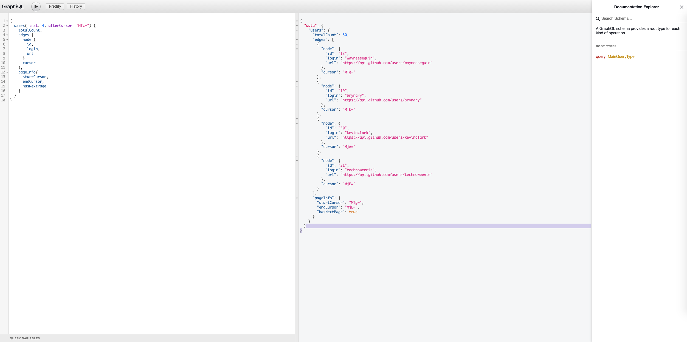

# GraphQL-server
GraphQL Server using express for cursor-based pagination to list github users

cursor info is returned with base64-encoded.

## Application build and run (file: ./GRAPHQL-SERVER)
```sh
cd graphql-server
npm i
npm start
```

